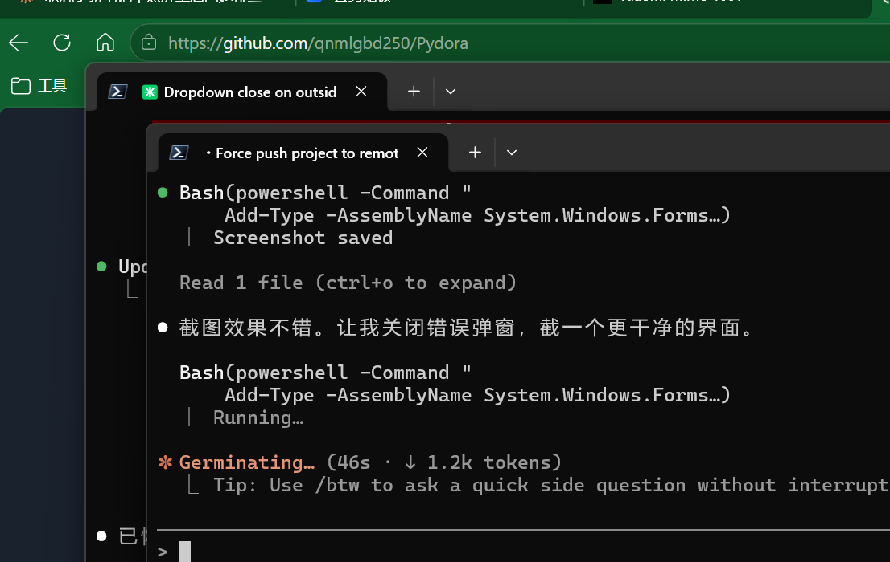

<div align="center">

# Pydora

**A lightweight Python script monitor with real-time logging, resource tracking, and process management.**

Built with [CustomTkinter](https://github.com/TomSchimansky/CustomTkinter) for a modern dark-themed UI on Windows.


</div>

<p align="center">
  
</p>

---

## Features

- **Script Management** -- Add, configure, and remove Python scripts via GUI
- **Process Control** -- Start / Stop / Pause / Resume individual or all scripts
- **Real-time Logs** -- Live stdout/stderr with timestamps and keyword search highlighting
- **Resource Monitoring** -- CPU, memory (RSS/VMS), threads, PID, and uptime per script
- **Auto Restart** -- Automatically restart scripts on abnormal exit
- **Multi-interpreter** -- Specify custom Python interpreters (venv, uv, etc.)
- **Feishu Alerts** -- Optional webhook notification on script crash
- **Persistent Config** -- Script list saved to `scripts_config.json`, restored on launch

## Quick Start

### Prerequisites

- Python 3.10+
- Windows 10/11

### Install & Run

```bash
pip install customtkinter psutil
python script_monitor.py
```

## Project Structure

```
.
├── script_monitor.py       # Main application (single file)
├── scripts_config.json     # Auto-generated script configuration
├── assets/
│   └── screenshot.png      # UI screenshot
└── README.md
```

## Status Indicators

| Color  | Status    | Description            |
|--------|-----------|------------------------|
| Green  | Running   | Script is active       |
| Gray   | Stopped   | Script is not running  |
| Orange | Paused    | Process suspended      |
| Red    | Error     | Startup/execution fail |

## Configuration

Each script entry in `scripts_config.json` supports:

```jsonc
{
  "name": "My Script",           // Display name
  "path": "/path/to/script.py",  // Script file path
  "args": "--port 8080",         // CLI arguments
  "interpreter": "",             // Custom Python path (empty = default)
  "auto_restart": false,         // Restart on exit
  "feishu_webhook": ""           // Feishu bot webhook URL
}
```

## Notes

- Pause/Resume uses `psutil.Process.suspend()` -- requires appropriate process permissions
- All running scripts are automatically stopped when the application closes
- Auto-restart only triggers after a script has been manually started at least once
- Child process output is forced to UTF-8 to avoid encoding issues on Windows

## License

MIT
